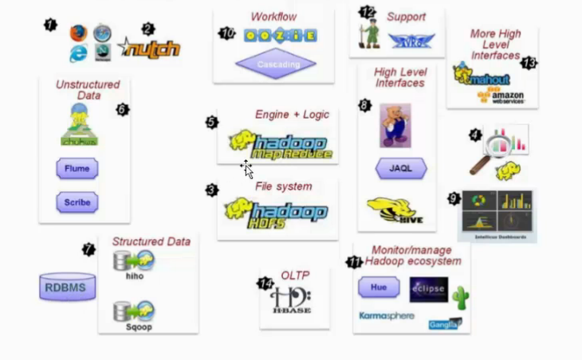
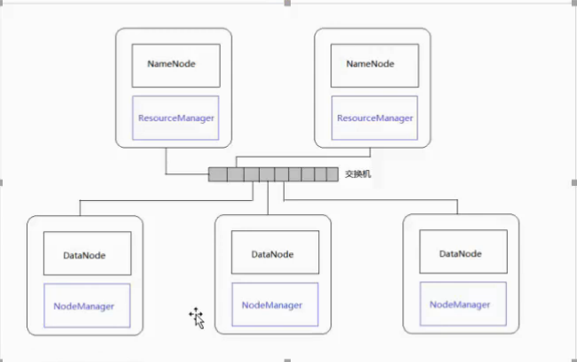

# Hadoop

## 1.Hadoop简介

Hadoop解决的问题： 
1. 海量数据存储 HDFS  
2. 海量数据的技术 MapReduce
3. 资源调度 YARN  

archive.apache.org     apache的开源项目

Hadoop代表生态圈，其重点组件  
1. ``HDFS：分布式文件系统``
2. ``MAPREDUCE:分布式运算程序开发框架``
3. ``HIVE：SQL数据仓库工具``
4. HBASE:基于Hadoop的分布式海量数据库
5. ``ZOOKEEPER：分布式协调服务基础组件``  
6. Sqoop:数据迁移工具
7. Flume：日志数据采集框架
8. ``YARN:资源调度系统``

## 2.HDFS,Maperduce简介

单机会有很多隐患，分布式解决存储容量，计算过重，单点故障 问题  
经典分布：主从架构（Masters-Slaves） 
单机独有：SecondayNameNode  帮助NameNode管理元数据  
NameNode维护映射（老大）  
DataNode负责数据存储（小弟）  

## 3.单机伪分布式

### 1. 安装虚拟软件  

### 2. Linux常用命令  

（帐号：root   123456）  
ls -a      把所有文件列出来  
ls -al	   列出更多  
列出的文件第一位表示类型：  d：文件夹      -：文件     l:链接   
后面root  root  ：所属用户，所属组  
后面数字： 文件夹的大小   时间  
pwd	   打印当前的工作路径  
man XX     查看该命令的作用  
mkdir -p   创建目录，-p表示强制创建  
rm -rf	   强制删除  
mv 	   移动，也可以用来重命名    
cp -r      拷贝，-r表示递归拷贝  
tar -zcvf   打包文件，-zcvf先打包然后进行压缩，-zxvf解压文件  

### 3. 配置linxu的基本环境（centos系统）

1. 修改机器名字，便于寻找  
可以直接修改配置文件  vi /etc/sysconfig/network  
修改hostname，保存退出  

（看到课时5，第4分钟）

  

 

  

