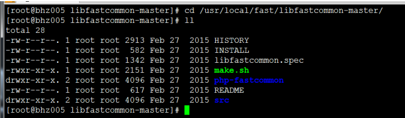
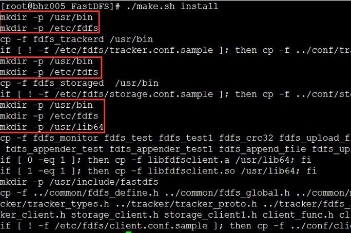
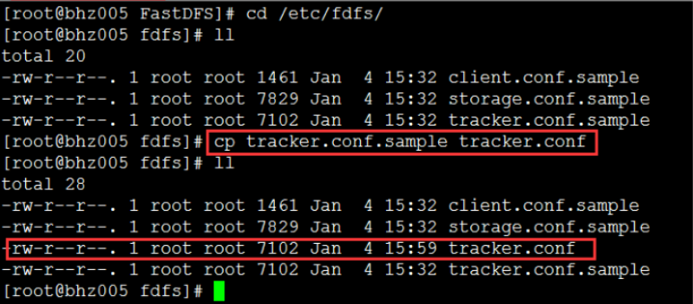
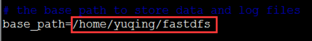
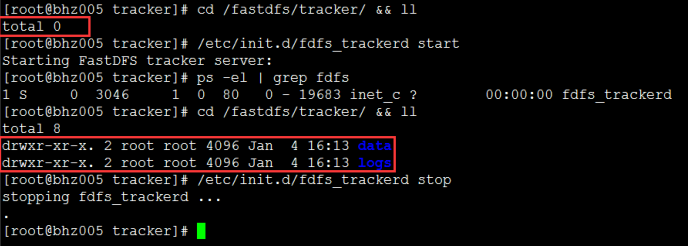
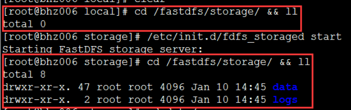

# FastDfs单机搭建   

## 1.环境安装

Z：所需工具如下  

1. [Xme_5.0.547.exe](https://pan.baidu.com/s/1i5ThZpz)  ：用来连接linux服务器，传输文件。   
2. [FastDFS_v5.05.tar.gz](https://pan.baidu.com/s/1htBPtiO)  ：  FastDfs核心文件   
3. [libfastcommon-master.zip](https://pan.baidu.com/s/1dGOMDJr) ：centOS安装FastDefs所需   
4. 已安装好的CentOs7系统的linux服务器    

Z：安装以下工具   

1. 安装好Xshell，并连接上linux系统    
2. 安装java环境，命令``yum install make cmake gcc gcc-c++``   
3. 上传 **libfastcommon-master.zip** & **FastDFS_v5.05.tar.gz** 到/usr/local/software下。  

## 2.安装libfastcommon   

1. 进入文件所在路径``cd /usr/local/software``  , 解压 **libfastcommon-master.zip** 命令：``unzip libfastcommon-master.zip -d /usr/local/fast/``   

2. 进入目录：``cd /usr/local/fast/libfastcommon-master/``   

      

3. 编译安装libfastcommon

   命令：``./make.sh``  

   命令：``./make.sh install``  

4. 因为FastDFS主程序设置目录为/usr/local/lib/,而我们安装的位置是/usr/lib64/，所以需要创建/usr/local/lib/文件夹，再将安装文件软连接过来。

   ```
   命令：mkdir /usr/local/lib/
   命令：ln -s /usr/lib64/libfastcommon.so /usr/local/lib/libfastcommon.so
   命令：ln -s /usr/lib64/libfastcommon.so /usr/lib/libfastcommon.so
   命令：ln -s /usr/lib64/libfdfsclient.so /usr/local/lib/libfdfsclient.so
   命令：ln -s /usr/lib64/libfdfsclient.so /usr/lib/libfdfsclient.so
   ```

## 3.安装FastDFS

1. 进入文件所在路径``cd /usr/local/software``  ,解压 **FastDFS_v5.05.tar.gz** 命令：``tar -zxvf FastDFS_v5.05.tar.gz -C /usr/local/fast/``   

2. 进入目录：``cd /usr/local/fast/FastDFS/``      

3. 编译安装FastDFS

   命令：``./make.sh``  

   命令：``./make.sh install``    

   

4. 因为FastDFS服务脚本设置的bin目录为/usr/local/bin/下,但是实际我们安装在了/usr/bin/下面。所以我们需要修改FastDFS配置文件中的路径:

   命令：``vim /etc/init.d/fdfs_storaged``

   进行全局替换命令：``:%s+/usr/local/bin+/usr/bin`` , 输入``wq``保存文本。   

   把文件中usr/local/bin全部替换成/usr/bin

   命令：``vim /etc/init.d/fdfs_trackerd``

   进行全局替换命令：``:%s+/usr/local/bin+/usr/bin``

   把文件中usr/local/bin全部替换成/usr/bin  

## 4.配置跟踪器trackerd   

1. 进入跟踪器所在路径``cd /etc/fdfs/``  , 把tracker.conf.sample文件复制一份，命名为tracker.conf：   

      

2. 修改配置文件``vim /etc/fdfs/tracker.conf`` , 将其base_path修改为 ``base_path=/fastdfs/tracker``     

     

3. 启动跟踪器   

   ```
   目录命令：cd /fastdfs/tracker/ && ll
   启动tracker命令：/etc/init.d/fdfs_trackerd start
   查看进程命令：ps -el | grep fdfs
   ```

   第一次启动成功，会在/fastdfs/tracker/目录下生成data & logs 两个文件夹：

     

   启动成功之后可以查看监听``netstat -unltp|grep fdfs`` 

## 5.配置存储器storage   

1. 进入跟踪器所在路径``cd /etc/fdfs/``  , 把storage.conf.sample文件复制一份，命名为storage.conf

2. 修改storage.conf配置文件： ``vim /etc/fdfs/storage.conf`` 

   ```
   base_path=/fastdfs/storage
   store_path0=/fastdfs/storage
   tracker_server=本机ip:22122
   http.server_port=8888
   ```

   【注意】因为单机部署，所以tracker_server指向本机的tracker。这里的本机ip不能用127.0.0.1，而应该是本机的真是ip，否者会启动失败。查看本机ip可以用``ifconfig``   

3. 创建存储目录：``mkdir -p /fastdfs/storage``   

4. 启动storage存储: ``/etc/init.d/fdfs_storaged start``   

   第一次启动成功，会在/fastdfs/storage/目录下生成data & logs 两个文件夹：

      

   用``ps -ef | grep fdfsp``查看是否启动成功,如果启动成功，会同时看到 tracker & storage 两个进程。   

   如果启动失败，可以进入logs文件查看对应的日志信息：``cat storage.log``     

##  6.后续配置   

1. 添加启动项

   为了让开机每次都启动tracker & storage ，进入rc.local ``vim /etc/rc.d/rc.local``添加以下命令:

   ```
   /etc/init.d/fdfs_trackerd start
   /etc/init.d/fdfs_storaged start
   ```

2. 开启防火墙   

   开启的方式有很多种，请自行搜索

3. 如果要文件能够通过http访问，还需要配置nginx，这里推荐文章[分布式文件系统FastDFS安装与配置(单机)](http://www.cnblogs.com/Eivll0m/p/5378328.html)

## 7.原理

1. storage是逐个和tracker进行交互的，tracker之间没有通讯
2. server存放随机，server直接平等，没有主从关系
3. 下载选择服务器的条件:源存储器，同步时间>创建时间的存储器，文件创建时间大于约定时间(如5分钟已同步完)

## 8.扩展使用

### 1.防止盗链

添加token：只能用在自己的网站，一定的时间过期 

### 2.减轻压力

fastdfs和nginx集成，直接从文件服务器取文件，减轻业务服务器的压力。

## 9.迁移文件目录

1. 创建新的文件目录``mkdir /mnt/fastdfsnew``   

2. 将所有文件拷贝到新目录下``cp -a /fastdfs/* /mnt/fastdfsnew ``(注意不要重复拷贝)   

3. 通过命令对比文件夹是否有差异``diff -r /fastdfs/ /mnt/fastdfsnew/``  

4. 分别查看文件夹大小``du -sh /fastdfs/ ``,``du -sh /mnt/fastdfsnew/ ``   

5. 修改存储器配置文件``vim /etc/fdfs/storage.conf``

   ```
   base_path=/fastdfs/storage  -->  /mnt/fastdfsnew/storage
   store_path0=/fastdfs/storage  -->  /mnt/fastdfsnew/storage
   ```

6. 重启存储器``/etc/init.d/fdfs_storaged restart``

