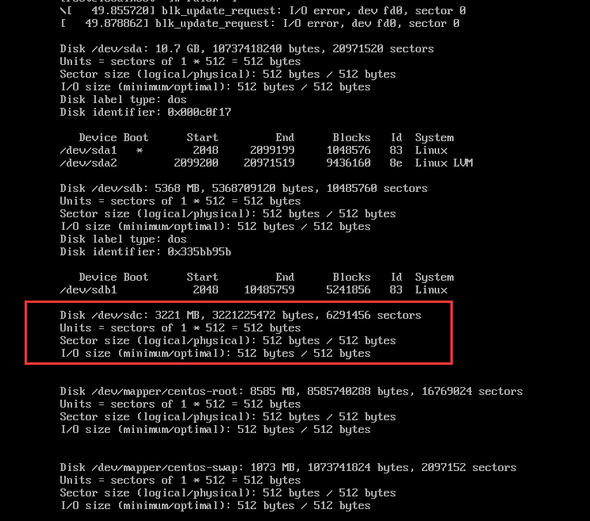
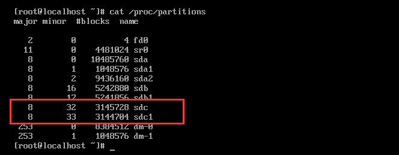

# 硬盘挂载

因为文件服务器空间不够，需要通过挂载新的磁盘来扩容。原先文件目录挂载在/根目录下。

挂载磁盘步骤如下：

1. 查看新增的磁盘 ``fdisk -l``  

     

2. 对新增磁盘进行分区``fdisk /dev/vdb(磁盘)``

   1. 输入n(增加一个新的分区)
   2. 选输入p（选则为主分区）
   3. 其次在输入1
   4. 之后按回车选择默认（即将一个2G的空间全部给这个分区了）
   5. 最后输入“w”,将分区保存并退出

3. 输入``fdisk -l``，再次查看分区是否完成分配  

4. 输入``cat /proc/partitions``,查看分区表是否更新  

     

5. 通过``mkfs -t ext3 /dev/vdb1(磁盘)``（**高危**）格式化磁盘为指定文件系统。

6. 将新硬盘挂载到新目录下

   1. ``cd /home/``
   2. ``mkdir fastdfsnew``
   3. ``mount /dev/vdb1(磁盘) /home/fastdfsnew``
   4. 查看挂载``df -h``

7. [迁移旧文件到新目录](https://github.com/leekoko/Linux/blob/master/doc/FastDfs.md#9迁移文件目录)

   	1. ``cp -a /fastdfs/* /home/fastdfsnew``    
    2. 修改配置文件指向新的目录（也可以将文件复制过来，删除旧的文件夹内容（**高危**））

8. 设置开机挂载

   1. ``vi /etc/fstab``
   2. 添加一行``/dev/sdc1  /home/fastdfsnew ext3  defaults  1  2``

9. 重启，``df -h``查看   

